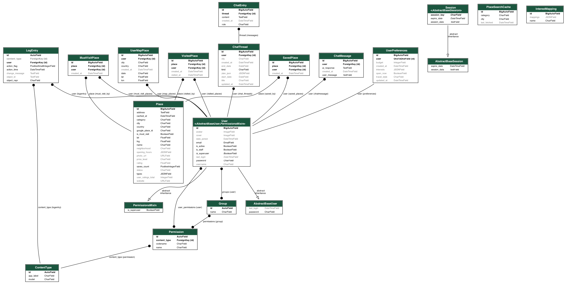

# BizbenSayahatta

Bizben Sayahatta is a travel inspiration and discovery platform where users can explore locations, view them on an interactive map, and share experiences through comments.

The project is built with a Django REST API backend and a React frontend — a full-stack architecture where the server exposes REST endpoints and the client consumes them to create an interactive travel experience.

The project is split into two main folders:

- **`back/`** — backend (Django REST API)
- **`front/`** — frontend (React + Vite)


## Backend (Django)

### Tech stack

- Python 3
- Django
- Django REST Framework
- Simple JWT (token auth)
- django-cors-headers, django-filter, python-dotenv
- PostgreSQL (via dj-database-url)
- Dependencies: see `back/requirements-base.txt`

### Setup

1. Go to the backend folder:
   ```bash
   cd back
   ```

2. Create and activate a virtual environment:
   ```bash
   python -m venv venv
   # macOS / Linux:
   source venv/bin/activate
   # Windows:
   venv\Scripts\activate
   ```

3. Install dependencies:
   ```bash
   pip install -r requirements-base.txt
   pip install Pillow   # if using image fields (avatars, etc.)
   ```

4. Create a `.env` file in `back/` (see **Environment variables** below). Do not commit `.env` to git.

5. Apply migrations and run the server:
   ```bash
   python manage.py makemigrations
   python manage.py migrate
   python manage.py runserver
   ```

Backend runs at **http://127.0.0.1:8000/**.

### Main API routes

| Prefix | Description |
|--------|-------------|
| `users/` | Signup, login (JWT), profile |
| `api/places/` | Places, inspiration, save/visited, map places, **place comments** |
| `api/marketplace/` | Trips, advisor categories, leaderboard, wishlists, manager/admin actions |
| `llm/` | Travel chat, plan, chat threads |
| `api/admin/` | Admin API: users, wishlists, visited places, threads, chat messages, **comments**, interests, audit log |

**Auth:** JWT. Obtain tokens via `POST /users/login/` (email + password). Use header: `Authorization: Bearer <access_token>`. Refresh: `POST /api/token/refresh/`.

**Place comments (Inspiration page):**

- `GET /api/places/{place_id}/comments/` — list comments (public)
- `POST /api/places/{place_id}/comments/` — create comment (auth required); body: `{"comment_text": "..."}` (3–1000 chars, trimmed)
- `DELETE /api/admin/comments/{comment_id}/` — delete comment (admin/manager only)


## Database Schema



## Frontend (React)

### Tech stack

- React 19
- Vite 7
- React Router
- Redux Toolkit
- Axios
- React Leaflet / Leaflet
- React Markdown

### Setup

1. Go to the frontend folder:
   ```bash
   cd front
   ```

2. Install dependencies:
   ```bash
   npm install
   npm install react-simple-maps --legacy-peer-deps   # if needed
   npm install react-i18next i18next                  
   npm install @emailjs/browser                       # if needed
   npm install react-leaflet leaflet                  # if using maps
   npm install dom-to-image-more                      # if using maps
   npm install jspdf html2canvas                      # if using maps
   ```

3. Create a `.env` in `front/` if needed (e.g. `VITE_API_BASE=http://127.0.0.1:8000`). Do not commit `.env` to git.

4. Run the dev server:
   ```bash
   npm run dev
   ```

Frontend runs at **http://localhost:5174/** (or the port Vite prints).


## Environment variables

- **Backend (`back/.env`):**  
  `SECRET_KEY`, `DEBUG`, `DATABASE_URL`, `OPENAI_API_KEY`, `GOOGLE_MAPS_API_KEY`, etc. Do not commit `.env` files.

- **Frontend (`front/.env`):**  
  e.g. `VITE_API_BASE` for the API base URL.


## Authors

Project developed by 
- Abilmazhinova Aisha
- Abitova Dina
- Ashimbekova Sabina
- Akhmetzhan Gaziza

