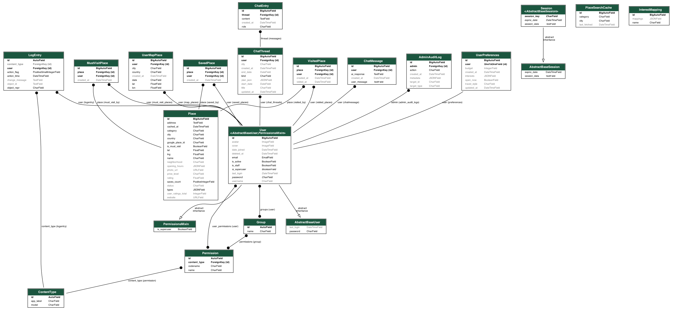

# 🌍 Bizben Sayahatta

**Bizben Sayahatta** is a travel inspiration and discovery platform where users can explore locations, view them on an interactive map, and share experiences through comments.

The project is built with a **Django REST API** backend and a **React** frontend — a full-stack architecture where the server exposes REST endpoints and the client consumes them to create an interactive travel experience.

---

## ✨ Features

- Explore travel destinations
- View places on an interactive map
- See detailed information about each location
- Leave comments under places
- REST API communication between frontend and backend
- Modular backend structure for easy scalability

---

## 🛠 Tech Stack

### Backend
- Python
- Django
- Django REST Framework
- Pillow
- PostgreSQL / SQLite

### Frontend
- React
- JavaScript
- Vite
- Leaflet + React Leaflet
- React Simple Maps

---

## 📁 Project Structure

```
BizbenSayahatta/
│
├── back/               # Django backend (API)
│   ├── manage.py
│   ├── apps/
│   ├── models/
│   ├── serializers/
│   └── views/
│
├── front/              # React frontend
│   ├── src/
│   ├── components/
│   ├── pages/
│   └── main.jsx
│
└── README.md
```

---

## 🚀 Getting Started

### Backend

**1. Navigate to the backend folder**
```bash
cd back
```

**2. Create a virtual environment**
```bash
python -m venv venv
```

**3. Activate the virtual environment**

macOS / Linux:
```bash
source venv/bin/activate
```

Windows:
```bash
venv\Scripts\activate
```

**4. Install dependencies**
```bash
pip install Pillow
pip install -r requirements-base.txt
```

**5. Apply migrations**
```bash
python manage.py makemigrations
python manage.py migrate
```

**6. Start the server**
```bash
python manage.py runserver
```

The backend will be available at: `http://127.0.0.1:8000/`

---

### Frontend

**1. Navigate to the frontend folder**
```bash
cd front
```

**2. Install dependencies**
```bash
npm install
npm install react-simple-maps --legacy-peer-deps
npm install react-leaflet leaflet
```

**3. Start the app**
```bash
npm run dev
```

The frontend will be available at: `http://localhost:5174/`

---

## 🔐 Environment Variables

Create a `.env` file inside the backend folder (`back/.env`):

```env
SECRET_KEY=your_secret_key
DEBUG=True
DATABASE_URL=your_database_url
```

> ⚠️ Never commit `.env` files to Git. Make sure they are listed in `.gitignore`.

---

## 🗄 Database Schema



---

## 📡 API Overview

| Method | Endpoint            | Description          |
|--------|---------------------|----------------------|
| GET    | `/api/places/`      | Get all places       |
| GET    | `/api/places/{id}/` | Get place by ID      |
| GET    | `/api/comments/`    | Get all comments     |
| POST   | `/api/comments/`    | Create a comment     |

The React frontend communicates with the Django backend through these REST API endpoints.

---

## 🗺 Map Integration

The project uses **Leaflet** and **React Leaflet** to display travel locations on an interactive map, letting users visually explore destinations.

---

## 🔮 Future Improvements

- [ ] User authentication (JWT)
- [ ] User profiles
- [ ] Favorite places
- [ ] Ratings and reviews
- [ ] Travel itinerary builder
- [ ] Admin moderation tools
